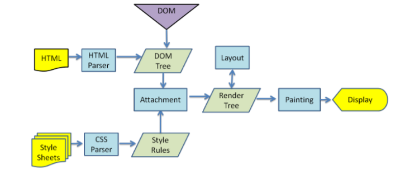

### 前言
**写笔记的本意是对自己所学知识的一个总结，目前文笔和技术都不算成熟，可能有些知识点表达的不是很准确或有误，欢迎批评指正~~**

## 什么是node.js呢？

我们先看一下，官方对node.js的定义：

```
Node.js® is a JavaScript runtime built on Chrome's V8 JavaScript engine.
```

翻译过来是： 

```
Node.js是一个基于V8 JavaScript引擎的JavaScript运行时环境。
```

这个官方的解释看起来十分的笼统。

要搞清楚上面这句话的含义，我们要知道

- 什么是V8？
- 什么是javascript引擎？
- 什么是javascript运行环境？
- 为什么javascript运行的时候需要特殊的运行环境？

那么让我们先把以上几点一一理清楚

## JavaScript代码在浏览器中是如何被执行的？

众所周知，javascript在发明之初，仅仅是应用于浏览器执行简单的脚本任务，对浏览器中的DOM元素进行各种操作，所以当时javascript的应用场景十分有限。但随着时间的推移，人们越来越注重上网的体验，

#### 不同的浏览器由不同的浏览器内核组成

- Gecko：早期被Netscape和Mozilla Firefox浏览器使用； 
- Trident：微软开发，被IE4~IE11浏览器使用，但是Edge浏览器已经转向Blink； 
- Webkit：苹果基于KHTML开发、开源的，用于Safari，Google Chrome之前也在使用； 
- Blink：是Webkit的一个分支，Google开发，目前应用于Google Chrome、Edge、Opera等； 
- 等等...

## 渲染引擎

事实上，我们经常说的浏览器内核指的是浏览器的排版引擎：

- 排版引擎（layout engine），也称为浏览器引擎（browser engine）、页面渲染引擎（rendering engine） 或样版引擎。

#### 渲染引擎的工作过程：

以下这张图可以完美的概括浏览器渲染页面的整个过程。



在这一过程中，当HTML解析的时候遇到了JavaScript标签，会停止解析HTML，而去加载和执行JavaScript代码。理由很简单。 

- 因为JavaScript代码可以操作我们的DOM；
- 所以浏览器希望将HTML解析的DOM和JavaScript操作之后的DOM放到一起来生成最终的DOM树，而不是 频繁的去生成新的DOM树；

而**javascript**就是由**javascript**引擎来执行的，

## javascript引擎

- 事实上我们编写的JavaScript无论你交给浏览器或者Node执行，最后都是需要被CPU执行的；
- 但是CPU只认识自己的指令集，实际上是机器语言，才能被CPU所执行；
- 所以我们需要JavaScript引擎帮助我们将JavaScript代码翻译成CPU指令来执行。

#### 常见的javascript引擎

- SpiderMonkey：第一款JavaScript引擎，由Brendan Eich开发（也就是JavaScript作者）； 
- Chakra：微软开发，用于IT浏览器； 
- JavaScriptCore：WebKit中的JavaScript引擎，Apple公司开发； 
- V8：Google开发的强大JavaScript引擎，也帮助Chrome从众多浏览器中脱颖而出；

#### webkit内核

这里我们先以WebKit为例，WebKit事实上由两部分组成的： 

- WebCore：负责HTML解析、布局、渲染等等相关的工作； 

- JavaScriptCore：解析、执行JavaScript代码； 

 看到这学过小程序的同学应该会感到很熟悉，因为在小程序中编写的JavaScript代码就是被JSCore执行的；


#### V8引擎

我们来看一下官方对V8引擎的定义： 

- V8是用C ++编写的Google开源高性能JavaScript和WebAssembly引擎，它用于Chrome和Node.js等。 
- 它实现ECMAScript和WebAssembly，并在Windows 7或更高版本，macOS 10.12+和使用x64，IA-32， ARM或MIPS处理器的Linux系统上运行。 
- V8可以独立运行，也可以嵌入到任何C ++应用程序中。

#### 简要介绍v8引擎原理


 V8引擎本身的源码非常复杂，大概有超过100w行C++代码，但是我们可以结合图片，简单了解一下它执行JavaScript代码的原理：

- Parse模块会将JavaScript代码转换成AST（抽象语法树），这是因为解释器并不直接认识JavaScript代码； 

  - 如果函数没有被调用，那么是不会被转换成AST的； 
  - Parse的V8官方文档：https://v8.dev/blog/scanner 

- Ignition是一个解释器，会将AST转换成ByteCode（字节码） p

  - 同时会收集TurboFan优化所需要的信息（比如函数参数的类型信息，有了类型才能进行真实的运算）； 
  - 如果函数只调用一次，Ignition会执行解释执行ByteCode； 
  - Ignition的V8官方文档：https://v8.dev/blog/ignition-interpreter  

- TurboFan是一个编译器，可以将字节码编译为CPU可以直接执行的机器码； -

  - 如果一个函数被多次调用，那么就会被标记为热点函数，那么就会经过TurboFan转换成优化的机器码，提高代码的执行性能； 
  - 但是，机器码实际上也会被还原为ByteCode，这是因为如果后续执行函数的过程中，类型发生了变化（比如sum函数原来执行的是number类型，后 来执行变成了string类型），之前优化的机器码并不能正确的处理运算，就会逆向的转换成字节码； 
  - TurboFan的V8官方文档：https://v8.dev/blog/turbofan-jit 

- 上面是JavaScript代码的执行过程，事实上V8的内存回收也是其强大的另外一个原因，不过这里暂时先不展开讨论： 

  - Orinoco模块，负责垃圾回收，将程序中不需要的内存回收； 
  - Orinoco的V8官方文档：https://v8.dev/blog/trash-talk

  ### 浏览器和Node的区别

  我们可以简单理解规划出Node.js和浏览器的差异：

  

  由图可见，除了HTML，webKit和显卡这些UI相关技术没有支持外，Node的结构与Chrome十分相似。它们二者都是基于事件驱动的异步架构，浏览器通过事件驱动来服务界面上的交互，而Node通过事件驱动来服务I/O。

  ## node.js的安装

  ```javascript
  下载地址：https://nodejs.org/en/
  ```

   Node.js是在2009年诞生的，目前最新的版本是分别是**LTS** 14.15.1，**Current**15.2.1

  #### 二者区别

  - LTS 版本:相对稳定一些，推荐线上环境使用该版本；
  - Current版本：最新的Node版本，包含很多新特性,但是有可能会有一些问题；

**安装**：安装过程中会配置环境变量（让我们可以在命令行使用）并且会安装npm（Node Package Manager）工具；（在后续的文章中会着重探究npm）


## Javascript文件在node中运行


- 首先电脑上需要安装Node.js环境，安装过程中会自动配置环境变量； 
- 可以通过终端命令node    js文件的方式来载入和执行对应的js文件；


#### Node程序传递参数

在某些特定的情况下，当我们在执行node程序的时候，可能希望给node传递一些参数

```javascript
node index.js  lx  111
```

如果我们这么做的话，即意味着程序中需要我们所传递的参数.

被传递的参数在node的全局对象process中的argv属性里面找到； 如果我们直接打印这个内置对象，会发现里面包含特别多的信息：比如版本、操作系统等。

argv属性对应的是一个数组，里面包含了我们传递的参数。有了这个数组我们就可以通过遍历的方式，轻而易举地拿到传递的每一个参数。


#### node中的全局对象

在上文提到了process这个全局对象，当然在node中提供了很多的全局对象，但是只有一部分是我们日常开发中经常使用的，在此简要介绍一下：

**process对象**：process提供了Node进程中相关的信息。

- 比如Node的运行环境、参数信息等；

**console对象：**提供了简单的调试控制台，

- console.log  最常用的输入内容的方式：console.log 
- console.clear  清空控制台：console.clear 
- console.trace  打印函数的调用栈：console.trace

当然还有一些其他的console的方法，就不一一列举了，可以参考以下地址学习一下

https://nodejs.org/dist/latest-v14.x/docs/api/console.html

**定时器函数：**在Node中使用定时器有好几种方式：

- setTimeout(callback, delay[, ...args])：callback在delay毫秒后执行一次； 
- setInterval(callback, delay[, ...args])：callback在每delay毫秒重复执行一次；  
- setImmediate(callback[, ...args])：callback 在I / O事件后的回调的“立即”执行；


